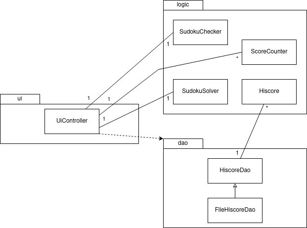
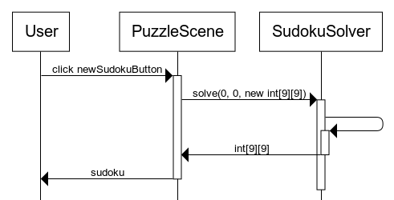
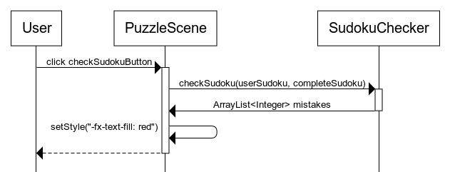

# Arkkitehtuurikuvaus

## Rakenne

Koodin pakkausrakenne on seuraava:

  

Pakkaus [sudokuapp.ui](https://github.com/osekeranen/java-11-sudoku-app/tree/master/SudokuApp/src/main/java/sudokuapp/ui) sisältää JavaFX:llä toteutetun graafisen käyttöliittymän, [sudokuapp.logic](https://github.com/osekeranen/java-11-sudoku-app/tree/master/SudokuApp/src/main/java/sudokuapp/logic) sovelluslogiikan ja [sudokuapp.dao](https://github.com/osekeranen/java-11-sudoku-app/tree/master/SudokuApp/src/main/java/sudokuapp/dao) tietojen pysyväistallenuksen.

## Käyttöliittymä

Käyttöliittymä on toteutettu pakkauksessa [sudokuapp.ui](https://github.com/osekeranen/java-11-sudoku-app/tree/master/SudokuApp/src/main/java/sudokuapp/ui). Sovellus sisältää viisi näkymää:

* päävalikko  
* vaikeusasteen valinta  
* peli  
* pelin pisteiden tallennus  
* ennätyspisteet  

Jokainen näistä on toteutettu omana luokkanaan, joka palauttaa *getScene*-metodilla näkymän ja näitä näkymiä ohjaa luokka [sudokuapp.ui.UiController](https://github.com/osekeranen/java-11-sudoku-app/blob/master/SudokuApp/src/main/java/sudokuapp/ui/UiController.java).

Vain käyttöliittymää ohjaava luokka [sudokuapp.ui.UiController](https://github.com/osekeranen/java-11-sudoku-app/blob/master/SudokuApp/src/main/java/sudokuapp/ui/UiController.java) kutsuu sovelluslogiikan metodeja.

## Sovelluslogiikka

Sovelluksen logiikan muodostavat pakkauksen [sudokuapp.logic](https://github.com/osekeranen/java-11-sudoku-app/tree/master/SudokuApp/src/main/java/sudokuapp/logic) luokat. Sovelluslogiikka tarjoaa luokkiensa avulla *UiControllerille* seuraavat toiminnallisuudet:

* [SudokuSolver](https://github.com/osekeranen/java-11-sudoku-app/blob/master/SudokuApp/src/main/java/sudokuapp/logic/SudokuSolver.java) luo sovelluksen sudokuristikot
* [SudokuChecker](https://github.com/osekeranen/java-11-sudoku-app/blob/master/SudokuApp/src/main/java/sudokuapp/logic/SudokuChecker.java) tarkastaa ne ja antaa käyttöliittymälle listan virheellisistä soluista
* [ScoreCounter](https://github.com/osekeranen/java-11-sudoku-app/blob/master/SudokuApp/src/main/java/sudokuapp/logic/ScoreCounter.java) hoitaa pisteiden laskemisen
* [Hiscore](https://github.com/osekeranen/java-11-sudoku-app/blob/master/SudokuApp/src/main/java/sudokuapp/logic/Hiscore.java) on pisteiden tallettamiseen tarkoitettu apuluokka
* [Difficulty](https://github.com/osekeranen/java-11-sudoku-app/blob/master/SudokuApp/src/main/java/sudokuapp/logic/Difficulty.java) on vaikeusasteet sisällään pitävä enum

Sovelluksen osien välisiä suhteita kuvaava luokka/pakkauskaavio:



## Tietojen pysyväistallennus

Pakkauksen [sudokuapp.dao](https://github.com/osekeranen/java-11-sudoku-app/tree/master/SudokuApp/src/main/java/sudokuapp/dao) luokka [FileHiscoreDao](https://github.com/osekeranen/java-11-sudoku-app/blob/master/SudokuApp/src/main/java/sudokuapp/dao/FileHiscoreDao.java) vastaa tietojen pysyväistallennuksesta.

### Tiedostot

Sovellus tallettaa kaikkien ratkaistujen sudokujen pisteet omille riveilleen [konfiguraatiotiedostossa](https://github.com/osekeranen/java-11-sudoku-app/blob/master/SudokuApp/config.properties) määriteltyyn tiedostoon muodossa

```
nimi;pisteet;vaikeusaste
```

Tästä esimerkkinä

```
Oskari;2859;BEGINNER
```

Sovelluksen käynnistyessä FileHiscoreDao lukee tiedoston tekee pisteistä *Hiscoreja* sisältävän ArrayListin.

## Päätoiminnallisuudet

### Sudokun luominen

Kun käyttäjä on klikannut uuden sudokun luovaa painiketta, sovellus toimii seuraavasti



Käyttöliittymä kutsuu SudokuSolveria joka luo uuden sudoku käyttäen rekursiivista *solve*-metodia ja siitä ratkaistavan version. SudokuSolver palauttaa sudokun käyttöliittymälle, joka luo sudokua vastaavan ristikon.

### Sudokun tarkastaminen

Kun käyttäjä on klikannut sudokun tarkistavaa painiketta, sovellus toimii seuraavasti



Käyttöliittymä tallettaa ristikossaan olevat numerot kaksiulotteiseen taulukkoon ja lähettää sen SudokuCheckerille tarkistettavaksi. SudokuChecker vertaa sitä alkuperäiseen ristikkoon ja palauttaa listan vääristä soluista. Käyttöliittymä maalaa sen jälkeen väärät solut punaisiksi ja ilmoittaa ScoreCounterille väärästä tarkistuksesta, ellei sudoku ole täysin oikein, jolloin sovellus siirtyy pistenäkymään.
