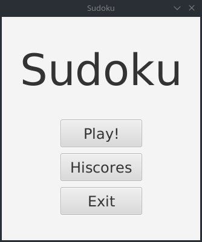
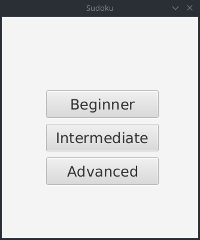
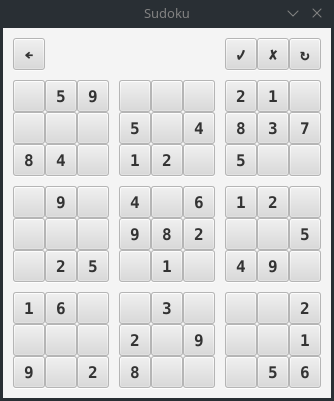
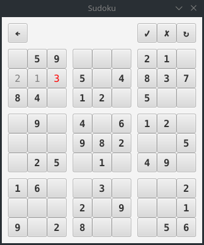
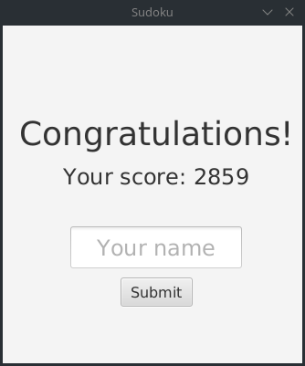
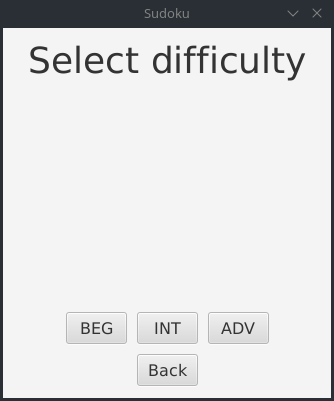
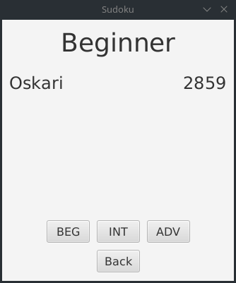

# Käyttöohje

Lataa tiedosto [SudokuApp.jar](https://github.com/osekeranen/ot-harjoitustyo/releases/tag/v1.1)

## Konfigurointi

Ohjelma olettaa, että sen käynnistyshakemistossa on konfiguraatiotiedosto *config.properties*, joka määrittelee ennätyspisteet tallettavan tiedoston ja ennätyspisteiden testauksessa käytetyn tiedoston nimet. Tiedosto täytyy luoda itse ja sen muoto on seuraava

```
hiscoreFile=hiscores
hiscoreTestFile=test-hiscores
```

## Ohjelman käynnistäminen

Ohjelma käynnistetään komennolla

```
java -jar SudokuApp.jar
```

## Valikko

Sovellus avautuu valikkonäkymään



* painamalla `Play!` pääset ratkaisemaan sudokua.
* painamalla `Hiscores` pääset tarkastelemaan pelin ennätyspisteitä.
* painamalla `Exit` suljet sovelluksen.

## Vaikeusasteen valinta

Painettuasi `Play!`-painiketta pääset valitsemaan vaikeusasteen, jonka mukaan peli generoi sudokun.



Tarjolla on kolme vaikeusastetta:

* vaikeusaste `Beginner` on helpoin ja pelin generoimassa sudokussa on valmiiksi 40 numeroa.
* vaikeusaste `Intermediate` on keskivaikea ja pelin generoimassa sudokussa on valmiiksi 30 numeroa.
* vaikeusaste `Advanced` on vaikein ja pelin generoimassa sudokussa on valmiiksi 20 numeroa.

## Sudokun ratkaiseminen

Valittuasi vaikeusasteen eteesi avautuu puolitäysi sudokuristikko



Ristikon yläpuolella näet neljä painiketta

* painamalla &#8592;-painiketta pääset takaisin päävalikkoon
* painamalla &#10003;-painiketta voit tarkistaa ristikon
* painamalla &#10007;-painiketta voit tyhjentää ristikon
* painamalla &#8635;-painiketta peli luo uuden sudokun

Pelin tarjoamat mustat numerot ovat varmasti oikeita vihjeitä. Käyttäjän syöttämät numerot ilmaistaan harmaalla


ja tarkistuksen jälkeen väärät numerot muuttuvat punaisiksi



## Pistenäkymä

Mikäli tarkastettava sudoku on oikein, käyttäjä voi syöttää oman nimensä tallennettavaksi ennätyspisteisiin. Syötettyyän nimensä ja painettuaan `Submit` käyttäjä palaa takaisin päävalikkoon.



Pisteet ovat sidonnaisia vaikeusasteeseen, eikä esimerkiksi helpoimmalla vaikeudella suoritetusta sudokusta saatuja pisteitä voi verrata vaikeimman vaikeusasteen pisteisiin. Kaava pisteiden laskemiseen on seuraava

```
pisteet = 3600 - kulunut aika - väärät tarkistukset * 100
```

## Ennätyspisteet

Peli tallentaa kaikki läpäistyt pelit konfiguraatiotiedostossa määritettyy tiedostoon. Käyttäjä voi tarkastella ennätyspisteitä painamalla `Hiscores`



ja tämän jälkeen valitsemalla vaikeusasteen, jonka ennätyspisteitä haluaa tarkastella


