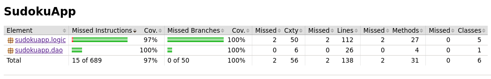

# Testausdokumentti

Ohjelmaa on testattu automaattisin JUnit-testein sekä manuaalisesti.

## JUnit-testit

### Sovelluslogiikka

Pakkauksen [sudokuapp.logic](https://github.com/osekeranen/java-11-sudoku-app/tree/master/SudokuApp/src/main/java/sudokuapp/logic) luokkia testaavat JUnit-testit [SudokuSolverTest](https://github.com/osekeranen/java-11-sudoku-app/blob/master/SudokuApp/src/test/java/sudokuapp/tests/SudokuSolverTest.java), [SudokuCheckerTest](https://github.com/osekeranen/java-11-sudoku-app/blob/master/SudokuApp/src/test/java/sudokuapp/tests/SudokuCheckerTest.java), [ScoreCounterTest](https://github.com/osekeranen/java-11-sudoku-app/blob/master/SudokuApp/src/test/java/sudokuapp/tests/ScoreCounterTest.java) ja [HiscoreTest](https://github.com/osekeranen/java-11-sudoku-app/blob/master/SudokuApp/src/test/java/sudokuapp/tests/HiscoreTest.java).

### DAO

Luokkaa [sudokuapp.dao.FileHiscoreDao](https://github.com/osekeranen/java-11-sudoku-app/blob/master/SudokuApp/src/main/java/sudokuapp/dao/FileHiscoreDao.java) testaa JUnit-testi [FileHiscoreDaoTest](https://github.com/osekeranen/java-11-sudoku-app/blob/master/SudokuApp/src/main/java/sudokuapp/dao/FileHiscoreDao.java).

### Testauskattavuus

Käyttöliittymäkerrosta lukuunottamatta sovelluksen testauksen rivikattavuus on 97% ja haarautumakattavuus 100%

## Manuaaliset testit

Sovellluksen asennusta on testattu asentamalla sovellus Linux-ympäristöön. Tietojen tallennusta on testattu [konfiguraatiotiedostossa](https://github.com/osekeranen/java-11-sudoku-app/blob/master/SudokuApp/config.properties) olevien tiedostojen ollessa jo valmiiksi ja ilman niitä. Sovellusta on testattu antamalla vääriä syötteitä.
