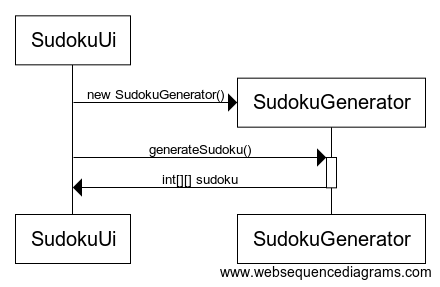

# Arkkitehtuurikuvaus
## Rakenne
Koodin pakkausrakenne on seuraava:

  

Pakkaus *sudokuapp.ui* sisältää JavaFX:llä toteutetun graafisen käyttöliittymän, *sudokuapp.logic* sovelluslogiikan ja *sudokuapp.dao* tietojen pysyväistallenuksen.

  

