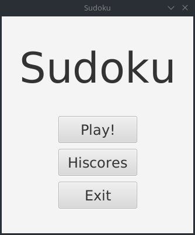
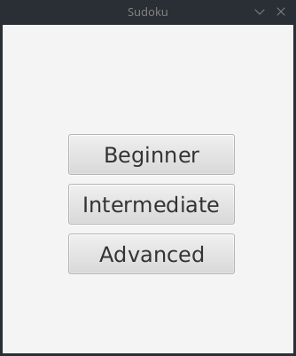
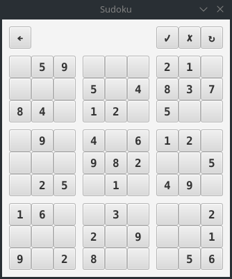
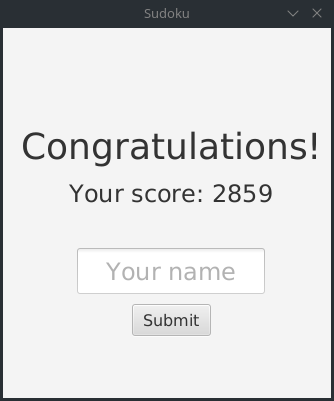
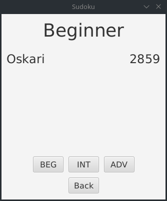

# Vaatimusmäärittely

## Sovelluksen tarkoitus

Sovellus on tarkoitettu [sudoku](https://en.wikipedia.org/wiki/Sudoku)-pelin pelaamiseen.

## Käyttöliittymäluonnos

Sovellus koostuu viidestä näkymästä

    

Sovellus aukeaa päävalikkoon, josta `Play!`-nappia klikkaamalla siirrytään valitsemaan vaikeusaste. Vaikeusasteen valittua näkymä vaihtuu itse pelinäkymään, josta se siirtyy pelin päätyttyä pistenäkymään. Päävalikosta pääsee myös `Hiscores`-nappia painamalla tarkastelemaan ennätyspisteitä.

## Perusversion tarjoama toiminnallisuus 

* Sovellus luo sudokuristikon ja siihen ratkaisun
* Käyttäjä voi pelata sudokua asettelemalla numeroita ristikkoon
* Käyttäjä voi tarkistaa sudokun painamalla tarkista-nappia
* Käyttäjä voi tyhjentää ristikon painamalla tyhjennä-nappia
* Käyttäjä voi valita vaikeusasteen, jonka perusteella sovellus luo sudokuristikon
* Aikaan ja tarkistuksiin perustuva pisteytys
  * Historian muistava hiscore
