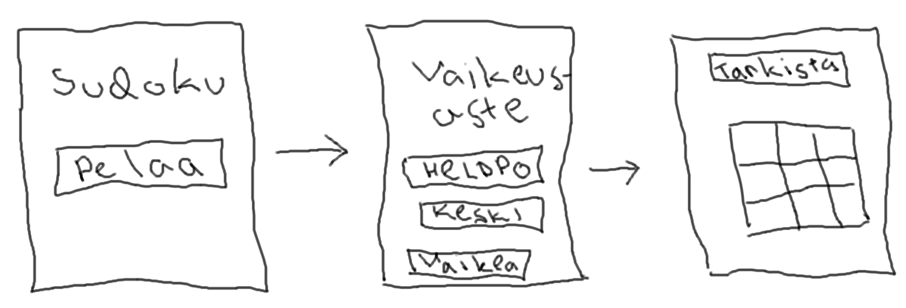

# Vaatimusmäärittely

## Sovelluksen tarkoitus

Sovellus on tarkoitettu [sudoku](https://en.wikipedia.org/wiki/Sudoku)-pelin pelaamiseen.

## Käyttöliittymäluonnos

Sovellus koostuu kolmesta näkymästä.

Sovellus aukeaa ns. Tervetuloa-näkymään, josta pelaa-nappia klikkaamalla siirrytään valitsemaan vaikeusaste. Vaikeusasteen valittua näkymä siirtyy itse pelinäkymään.

## Perusversion tarjoama toiminnallisuus 

* Sovellus luo sudokuristikon ja siihen ratkaisun *tehty*

* Käyttäjä voi pelata sudokua asettelemalla numeroita ristikkoon *tehty*

* Käyttäjä voi tarkistaa sudokun painamalla tarkista-nappia *tehty*

* Käyttäjä voi tyhjentää ristikon painamalla tyhjennä-nappia *tehty*

## Jatkokehitysideoita

* Käyttäjä voi valita vaikeusasteen, jonka perusteella sovellus luo sudokuristikon *tehty*

* Vaikeusasteen mukaan toimiva tarkistus
  * Helpolla vaikeusasteella tarkistus ilmoittaa jokaisen väärän numeron
  * Keskivaikealla ilmoittaa väärät 3x3 ristikot
  * Vaikealla ilmoittaa onko koko sudoku väärin vai oikein
  
* Aikaan ja tarkistuksiin perustuva pisteytys
  * Historian muistava hiscore
